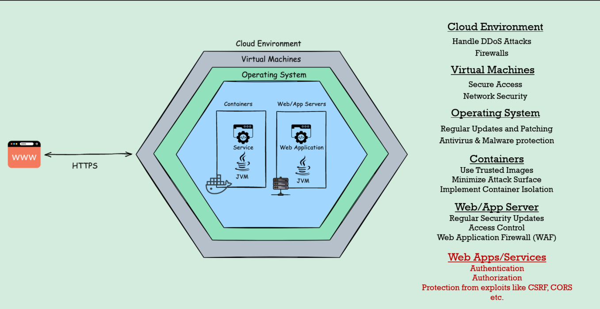

# 시큐리티

## 보안이란 무엇이며, 왜 중요한가.

### 민감한 데이터나 개인 데이터를 보호해야 하기 때문
- 단지 데이터 뿐 아니라 비즈니스 로직을 보호하는 경우도 있음


### 보안은 비기능적 요구사항이다
<details>
<summary> 기능적 요구사항 </summary>

- 비즈니스 로직
- 데이터 저장 방식
- UI 표시
- etc
</details>
<details>
<summary> 비기능적 요구사항</summary>

- 보안
- 성능
- 확장성
- 가용성
</details>
어떤 고객도 구체적으로 안전하거나 성능이 좋은 웹 어플리케이션을 만들어달라고 하지않는다 
단지 기본적으로 모든 개발자나 팀은 이러한 비기능적 요구 사항을 가정해야 함


### 개발 단계에서부터 보안을 구현하는 것을 고려해야 함
- 보안을 배포 직전이나 UAT 테스트 후에만 처리할 수 있는게 아님
- 요즘 대부분의 기업들이 SDLC(소프트웨어 생명 주기)의 왼쪽으로 보안을 이동하려고 노력
- ```SLDC = 기획 -> 설계 -> 개발 -> 테스트 -> 배포 ```
- 과거의 기업들은 테스트 단계에서 보안을 구현하려 했으나 문제 발생(Regression 발생)
- 보안을 일찍 고려할 수록 더 나은 애플리케이션을 개발 가능
- 요즘은 개발 단계에서 보안을 구현하려고 함 
  - 이는 비즈니스 로직을 구현할 때 웹 애플리케이션 내부에 보안을 구현하는것도 고려해야함을 의미
- 새로운 개념 등장 DevSecOps (개발팀, 보안팀, 운영팀이 함께 협력)


### 보안에는 여러 유형이 있음
- 방화벽
- HTTPS 프로토콜
- SSL 인증서
- 인증/인가


### 일반적인 공격을 피하는데에도 신경써야 함
- CSRF
- 세션 고정 공격
- 크로스 사이트 스크립팅

### 일반적인 보안 이미지

- 클라우드 환경
  - 가상 머신
    - 운영 체제
      - 도커 사용시 컨테이너 내부에 애플리케이션 배포
      - 모놀리식 배포에는 웹서버나 앱 서버 내부에 배포
- 배포 후에 클라이언트는 HTTPS 프로토콜을 통해 트래픽을 보내 응답을 받을 수 있음
- 위 인프라엔 각 계층별로 보안 메커니즘이 있음